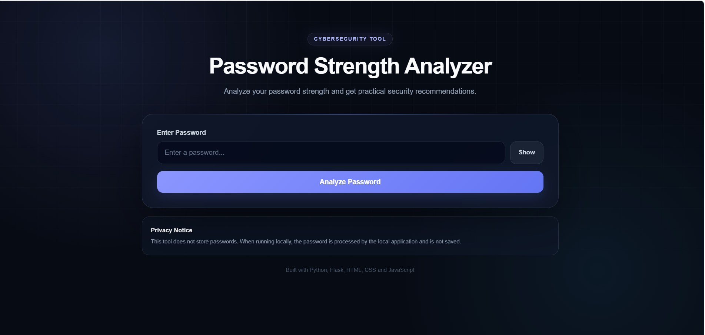
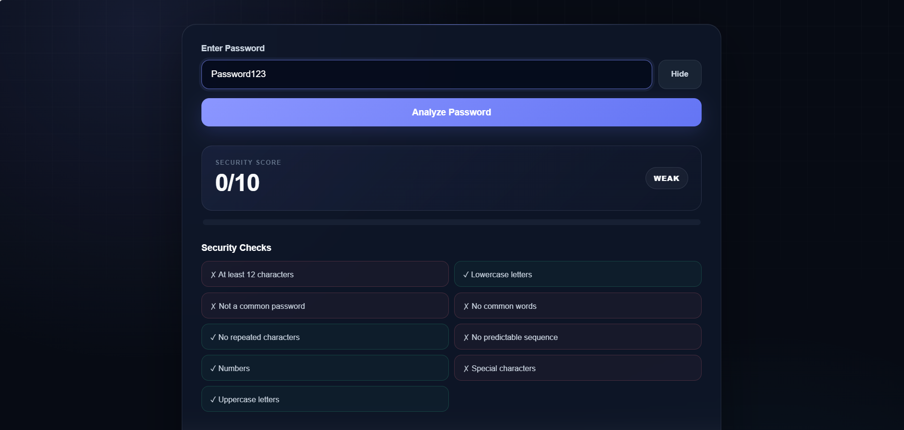
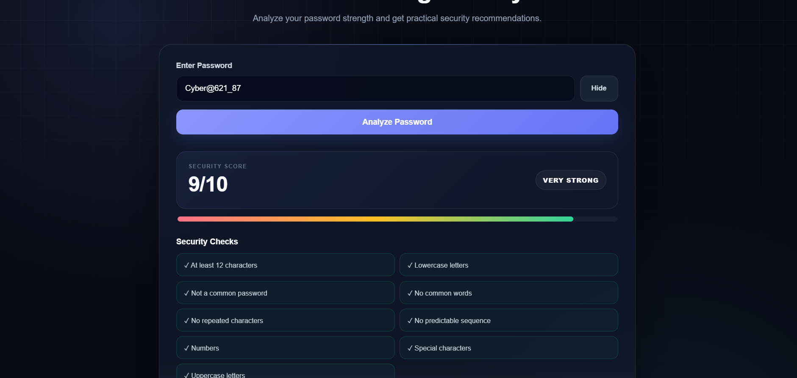

# 🔐 Password Strength Analyzer

A Python and Flask-based cybersecurity web application that analyzes password strength using multiple security checks and provides practical recommendations for creating stronger passwords.

## 🚀 Features

- Password strength scoring from 0–10
- Weak, Medium, Strong and Very Strong classification
- Password visibility toggle
- Length analysis
- Uppercase and lowercase detection
- Number detection
- Special character detection
- Common password detection
- Common word detection
- Sequential pattern detection
- Repeated character detection
- Security warnings
- Personalized recommendations
- Responsive cybersecurity-themed interface
- Local password processing with no password storage

## 🛠️ Tech Stack

- Python
- Flask
- HTML5
- CSS3
- JavaScript
- Regular Expressions
- Git & GitHub

## 🧠 How It Works

The application follows this flow:

User enters password  
↓  
Frontend sends password to Flask  
↓  
Python password analysis engine  
↓  
Security checks are performed  
↓  
Password receives a score  
↓  
Warnings and recommendations are generated  
↓  
Results are displayed on the dashboard

## 📊 Security Checks

The analyzer evaluates:

- Password length
- Uppercase letters
- Lowercase letters
- Numbers
- Special characters
- Common passwords
- Common words
- Predictable sequences
- Repeated characters
## 🖥️ Screenshots

### Main Interface



### Weak Password Analysis



### Strong Password Analysis



## 💻 Installation

Clone the repository:

```bash
git clone https://github.com/YOUR-USERNAME/password-strength-analyzer.git